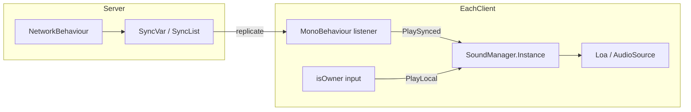
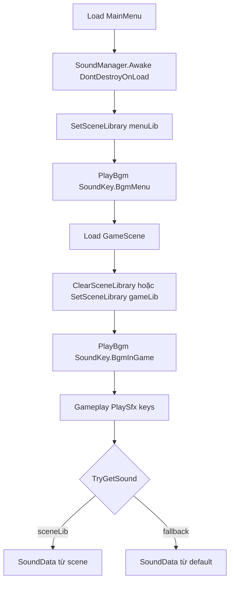

# Hướng dẫn cài đặt âm thanh (Sound System)

> Module: `Assets/Scripts/Core/Sound/`  
> Cập nhật theo code hiện tại: `SoundManager`, `SoundLibrary`, `SoundData`, `SoundKey`.

---

## 1. Tổng quan kiến trúc

```txt
SoundKey (hằng string)     ← code gameplay gọi key chuẩn
        ↓
SoundManager (singleton)     ← PlaySfx / PlayBgm, DontDestroyOnLoad
        ↓ lookup theo key
SoundLibrary (SO)            ← gom nhiều SoundData, 1 file / scene hoặc default
        ↓
SoundData (SO)               ← 1 entry: key + AudioClip + volume
```

| File | Vai trò |
|------|---------|
| `SoundKey.cs` | Định nghĩa key chuẩn — **luôn dùng constant**, không hardcode string rải rác |
| `SoundData.cs` | ScriptableObject: một âm thanh (clip + volume + key) |
| `SoundLibrary.cs` | ScriptableObject: danh sách `SoundData`, tra cứu theo key |
| `SoundManager.cs` | Phát SFX/BGM, singleton `DontDestroyOnLoad` |
| `SoundPlayback.cs` | API `PlayLocal` / `PlaySynced` — quy ước multiplayer |
| `SoundScope.cs` | Enum `Local` / `Synced` (tài liệu / quy ước) |

---

## 2. ScriptableObject là gì? (trong project này)

**ScriptableObject (SO)** là asset dữ liệu trong Unity — không gắn trên GameObject, lưu thành file `.asset` trong Project.

**Vì sao dùng SO cho âm thanh:**

- Designer chỉnh clip/volume trên Inspector, không sửa code
- Nhiều scene dùng chung `SoundManager`, mỗi scene gắn `SoundLibrary` riêng → giảm RAM (chỉ load clip scene cần)
- Key ổn định (`sfx.place_bomb`) tách khỏi file audio cụ thể

### 2.1 `SoundData` — một âm thanh

Menu tạo: **Create → Sound → Sound Data**

| Field | Mô tả |
|-------|--------|
| `key` | Chuỗi định danh — **phải khớp** `SoundKey` hoặc convention bên dưới |
| `clip` | `AudioClip` (.wav / .ogg / …) |
| `volume` | 0–1, áp dụng khi phát |

Ví dụ asset: `Assets/Audio/SFX/sfx_place_bomb.asset` với `key = sfx.place_bomb`.

### 2.2 `SoundLibrary` — bộ sưu tập

Menu tạo: **Create → Sound → Sound Library**

| Field | Mô tả |
|-------|--------|
| `sounds` | List các `SoundData` — kéo thả asset vào |

Runtime build dictionary `key → SoundData`. Key trùng nhau → entry sau ghi đè entry trước.

---

## 3. Cơ chế swap Sound Library

`SoundManager` giữ **hai tầng** library:

```txt
1. sceneLibrary   ← gắn tạm theo scene (ưu tiên cao)
2. defaultLibrary ← fallback toàn game (gắn trên SoundManager)
```

Tra cứu trong `TryGetSound(key)`:

```txt
sceneLibrary có key?  → dùng
không → defaultLibrary có key? → dùng
không → null + LogWarning khi Play*
```

### 3.1 Khi nào swap?

| Thư viện | Dùng cho |
|----------|----------|
| **defaultLibrary** | Key dùng mọi nơi: UI click, pickup, explosion, BGM menu… |
| **sceneLibrary** | Clip chỉ scene đó: map theme BGM, ambient đặc thù GameScene |

**Mục tiêu:** Vào `GameScene` load `GameScene_SoundLibrary.asset` (chỉ clip in-game), thoát scene `ClearSceneLibrary()` — clip scene cũ không còn reference → GC/unload được.

### 3.2 API swap

```csharp
// Khi vào scene (vd. Start / scene bootstrap)
SoundManager.Instance.SetSceneLibrary(gameSceneLibrary);

// Khi rời scene
SoundManager.Instance.ClearSceneLibrary();
```

### 3.3 Gợi ý cấu trúc asset

```txt
Assets/Audio/
├── Libraries/
│   ├── SoundLibrary_Default.asset    ← gán vào SoundManager
│   ├── SoundLibrary_GameScene.asset
│   └── SoundLibrary_MainMenu.asset
└── Data/
    ├── sfx_place_bomb.asset
    ├── sfx_explosion.asset
    ├── bgm_menu.asset
    └── bgm_ingame.asset
```

---

## 4. Cài đặt SoundManager (MainMenu — từ đầu game)

`SoundManager` được gắn **ngay MainMenu** — scene load đầu tiên trong build. `Awake()` gọi `DontDestroyOnLoad`, nên mọi scene sau (Lobby, GameScene, …) **không cần** tạo lại; chỉ gọi `SoundManager.Instance` hoặc `SoundPlayback`.

### Bước 1 — MainMenu scene

1. Empty GameObject tên `SoundManager`
2. Add Component → `SoundManager`
3. Kéo `SoundLibrary_Default.asset` vào **Default Library**

`SoundManager` tự `DontDestroyOnLoad` — chỉ cần **một instance** trong build.

### Bước 2 — AudioSource (tùy chọn)

Inspector có thể gán sẵn:

| Field | Ghi chú |
|-------|---------|
| `sfxSource` | Để trống → tự tạo child `SFX` lúc Awake |
| `bgmSource` | Để trống → tự tạo child `BGM`, `loop = true` |
| `sfxPitchMin` / `sfxPitchMax` | Random pitch mỗi SFX (mặc định 0.92–1.08) |

### Bước 3 — Bootstrap scene (ví dụ)

```csharp
public class MainMenuSoundBootstrap : MonoBehaviour
{
    [SerializeField] SoundLibrary menuLibrary;

    void Start()
    {
        SoundManager.Instance.SetSceneLibrary(menuLibrary);
        SoundManager.Instance.PlayBgm(SoundKey.BgmMenu);
    }

    void OnDestroy()
    {
        if (SoundManager.Instance != null)
            SoundManager.Instance.ClearSceneLibrary();
    }
}
```

```csharp
// GameScene tương tự
SoundManager.Instance.SetSceneLibrary(gameLibrary);
SoundManager.Instance.PlayBgm(SoundKey.BgmInGame);
```

---

## 5. Cách gọi phát âm thanh

Sau khi MainMenu đã tạo `SoundManager`, mọi scene dùng:

```csharp
SoundManager.Instance.PlaySfx(SoundKey.SfxExplosion);
// hoặc qua SoundPlayback (khuyến nghị — thể hiện ý định Local/Synced)
SoundPlayback.PlaySynced(SoundKey.SfxExplosion);
SoundPlayback.PlayLocal(SoundKey.SfxPickup);
```

### 5.1 SFX — one-shot

```csharp
SoundPlayback.PlaySynced(SoundKey.SfxPlaceBomb);
SoundPlayback.PlaySynced(SoundKey.SfxExplosion);
SoundPlayback.PlayLocal(SoundKey.SfxPickup);
```

Hoặc trực tiếp `SoundManager.Instance.PlaySfx(...)` — cùng kết quả.

- Dùng `AudioSource.PlayOneShot` — chồng nhiều SFX cùng lúc được
- Pitch random nhẹ mỗi lần phát

### 5.2 BGM — nhạc nền loop

```csharp
// Phát BGM (không restart nếu đang phát cùng key + clip)
SoundManager.Instance.PlayBgm(SoundKey.BgmInGame);

// Ép phát lại từ đầu
SoundManager.Instance.PlayBgm(SoundKey.BgmInGame, restartIfSame: true);

// Dừng
SoundManager.Instance.StopBgm();

// Chỉnh volume runtime (0–1)
SoundManager.Instance.SetBgmVolume(0.5f);
```

### 5.3 Kiểm tra trước khi phát (tùy chọn)

```csharp
if (SoundManager.Instance.TryGetSound(SoundKey.SfxPickup, out SoundData data))
{
  // data.clip, data.volume
}
```

### 5.4 Ví dụ gắn gameplay (local)

```csharp
// Chỉ owner nhặt buff
if (isOwner)
    SoundPlayback.PlayLocal(SoundKey.SfxPickup);
```

---

## 6. Multiplayer — âm thanh Local vs Synced

Bommy **không** stream audio qua PurrNet. Mỗi client tự `PlaySfx` trên `SoundManager` local. “Đồng bộ” nghĩa là **mọi client cùng gọi phát** khi nhận cùng một sự kiện replicate — không phải một máy phát cho cả phòng.

```txt
SoundManager (MainMenu, DontDestroyOnLoad)
        ↑
   PlaySfx trên TỪNG máy
        ↑
┌───────┴────────┐
│ Local          │ Synced
│ isOwner only   │ SyncVar / SyncList / event trên mọi client
└────────────────┘
```

### 6.1 Khi nào dùng gì?

| Loại | `SoundPlayback` | Ai gọi | Ví dụ key |
|------|-----------------|--------|-----------|
| **Synced** | `PlaySynced` | Handler chạy trên **mọi client** sau replicate | `SfxExplosion`, `SfxPlaceBomb`, `SfxMatchEnd` |
| **Local** | `PlayLocal` | Chỉ `isOwner` hoặc UI máy mình | `SfxPickup`, `SfxPlayerHurt` |
| **BGM** | `PlayBgm` | Bootstrap scene / listener (thường mọi client cùng lúc) | `BgmMenu`, `BgmInGame` |

### 6.2 Pattern: MonoBehaviour listen SyncVar (đúng ý bạn)

`NetworkBehaviour` replicate state → **MonoBehaviour** (UI hoặc listener riêng) subscribe event → gọi `SoundPlayback.PlaySynced`.

Không cần `NetworkBehaviour` cho âm thanh; chỉ cần `SoundManager.Instance` đã sống từ MainMenu.

**Ví dụ — Game Over (mọi client nghe):**

```csharp
public class MatchEndSoundListener : MonoBehaviour
{
    void Start() => StartCoroutine(Bind());

    IEnumerator Bind()
    {
        while (MatchGameplayAuthority.Instance == null)
            yield return null;

        MatchGameplayAuthority.Instance.MatchFinishedChanged += OnMatchFinished;
    }

    void OnDestroy()
    {
        if (MatchGameplayAuthority.Instance != null)
            MatchGameplayAuthority.Instance.MatchFinishedChanged -= OnMatchFinished;
    }

    void OnMatchFinished(bool finished)
    {
        if (!finished)
            return;

        SoundPlayback.PlaySynced(SoundKey.SfxMatchEnd);
        SoundPlayback.StopBgm();
    }
}
```

`matchFinished` là `SyncVar` → event fire trên host lẫn client → âm thanh khớp game over UI.

**Ví dụ — Nổ bom (SyncList, trong `ExplosionCreator`):**

```csharp
void OnDestroyedCellsChanged(SyncListChange<Vector3Int> change)
{
    if (change.operation != SyncListOperation.Added)
        return;

    ApplyDestroyCellLocal(change.value);
    SoundPlayback.PlaySynced(SoundKey.SfxExplosion); // mọi client
}
```

**Ví dụ — Đặt bom:** khi `BombController` `OnSpawned` trên mọi client (network spawn object) → `PlaySynced(SoundKey.SfxPlaceBomb)`.

**Ví dụ — Nhặt buff (local):**

```csharp
// Trong PickableBuff — chỉ player owner nhặt
if (playerEffects.isOwner)
    SoundPlayback.PlayLocal(SoundKey.SfxPickup);
```

**Ví dụ — Bị trúng / mất máu (local):**

```csharp
// PlayerBoardSlotUI hoặc listener trên board local
void OnLocalHpChanged(int oldHp, int newHp)
{
    if (!isLocalSlot || newHp >= oldHp)
        return;

    SoundPlayback.PlayLocal(SoundKey.SfxPlayerHurt);
}
```

### 6.3 Những gì KHÔNG nên làm

| Sai | Đúng |
|-----|------|
| `PlaySfx` explosion chỉ trong `if (isServer)` | Gọi trong `onChanged` / visual path **mọi client** |
| `PlayLocal` nhặt buff trên server | `if (isOwner) PlayLocal` |
| Tạo `SoundManager` mới mỗi scene | Một instance MainMenu + `Instance` |
| Gửi RPC chỉ để phát SFX | Dùng replicate sẵn có (SyncVar/SyncList/spawn) |

### 6.4 Join muộn / replay

Giống VFX: client join giữa trận chỉ nghe âm thanh của **sự kiện mới** sau khi subscribe — không replay tiếng nổ cũ (trừ khi bạn chủ động replay từ SyncList history).

### 6.5 Sơ đồ



---

## 7. Chuẩn đặt key (`SoundKey.cs`)

```csharp
public static class SoundKey
{
    // Synced — handler replicate, mọi client
    public const string SfxPlaceBomb = "sfx.place_bomb";
    public const string SfxExplosion = "sfx.explosion";
    public const string SfxMatchEnd = "sfx.match_end";

    // Local — isOwner / UI máy mình
    public const string SfxPickup = "sfx.pickup";
    public const string SfxPlayerHurt = "sfx.player_hurt";

    // BGM
    public const string BgmMenu = "bgm.menu";
    public const string BgmInGame = "bgm.ingame";
}
```

### Quy tắc đặt key

| Quy tắc | Ví dụ |
|---------|--------|
| Chữ thường, phân tầng bằng dấu `.` | `sfx.place_bomb` |
| Prefix loại âm thanh | `sfx.*` = hiệu ứng ngắn, `bgm.*` = nhạc nền |
| Từ khóa snake_case sau prefix | `sfx.player_hurt`, `bgm.boss` |
| **Thêm key mới** → khai báo trong `SoundKey.cs` **và** tạo `SoundData` cùng key | Tránh typo giữa code và asset |

| Prefix | Scope gợi ý |
|--------|-------------|
| `sfx.*` (bom, nổ, match_end) | **Synced** |
| `sfx.*` (pickup, hurt) | **Local** |
| `bgm.*` | Bootstrap / event sync toàn client |

### Quy trình thêm âm thanh mới

1. Thêm constant vào `SoundKey.cs` (đúng region Synced hoặc Local)
   ```csharp
   public const string SfxPlayerHurt = "sfx.player_hurt";
   ```
2. **Create → Sound → Sound Data** → điền `key` **giống hệt** string trên
3. Kéo `SoundData` vào `SoundLibrary` (default hoặc scene)
4. Gọi `SoundPlayback.PlayLocal` hoặc `PlaySynced` đúng chỗ (mục 6)

### Lỗi thường gặp

| Triệu chứng | Nguyên nhân |
|-------------|-------------|
| `Không tìm thấy SFX '...'` | Key trong code ≠ key trên `SoundData`, hoặc chưa add vào Library |
| Có asset nhưng không phát | `clip` = None trên `SoundData` |
| Scene không đổi nhạc | Quên `SetSceneLibrary` / quên `PlayBgm` sau swap |
| Key trùng trong 1 Library | Entry sau che entry trước — chỉ một clip được dùng |

---

## 7. Checklist cài đặt nhanh

### Assets

- [ ] Tạo `SoundData` cho từng clip (key khớp `SoundKey`)
- [ ] Tạo `SoundLibrary_Default` — chứa toàn bộ SFX + BGM dùng chung
- [ ] (Tuỳ chọn) `SoundLibrary_GameScene`, `SoundLibrary_MainMenu` cho clip theo scene

### Scene

- [ ] **MainMenu:** một `SoundManager` + `defaultLibrary` (DontDestroyOnLoad)
- [ ] Bootstrap mỗi scene: `SetSceneLibrary` + `PlayBgm` phù hợp
- [ ] `OnDestroy` / rời scene: `ClearSceneLibrary`

### Code

- [ ] Chỉ gọi `SoundKey.*`, không magic string
- [ ] Gameplay: `PlayLocal` vs `PlaySynced` đúng scope (mục 6)
- [ ] Listener MonoBehaviour cho âm sync (game over, …) nếu không gắn trực tiếp vào NetworkBehaviour

---

## 9. Sơ đồ luồng theo scene



---

*Khi thêm key: cập nhật `SoundKey.cs`, `SoundLibrary` asset, và bảng scope mục 6.*
