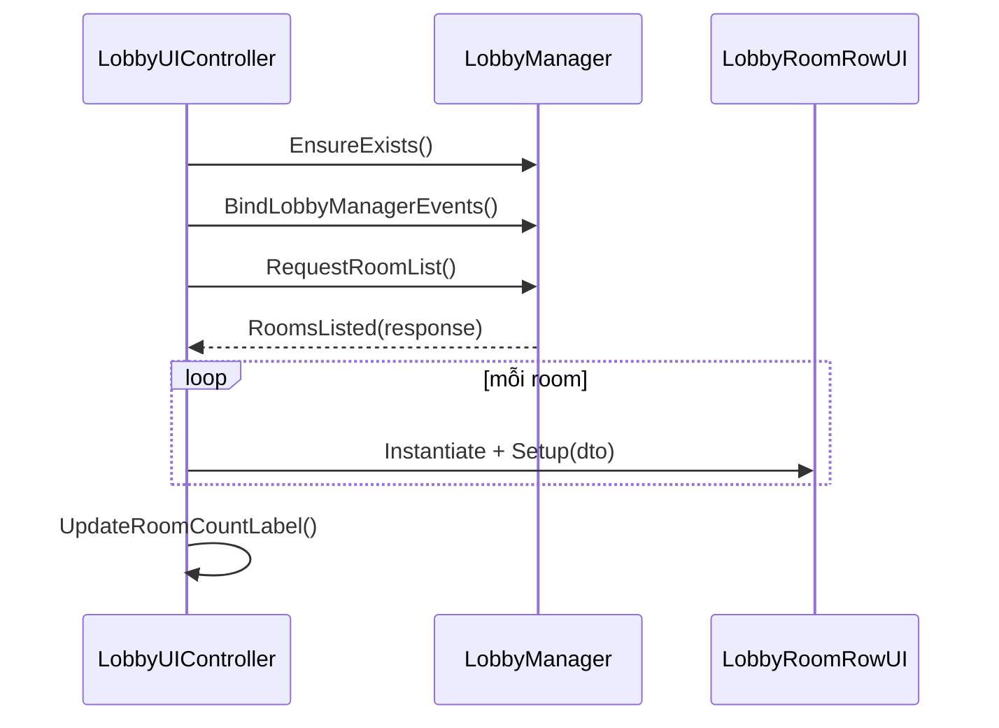
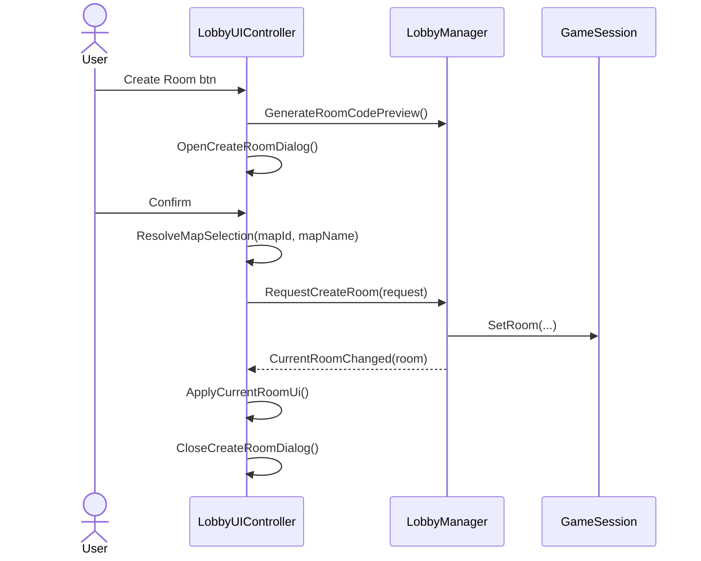
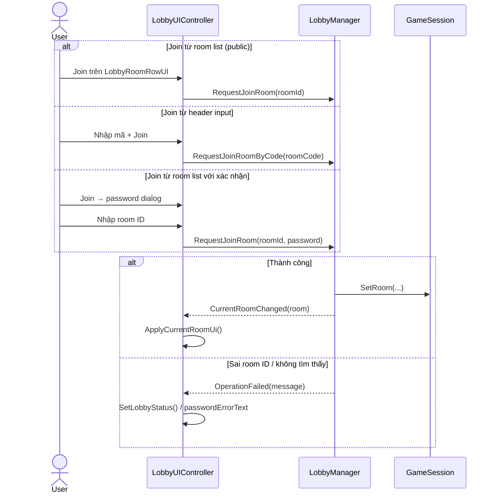
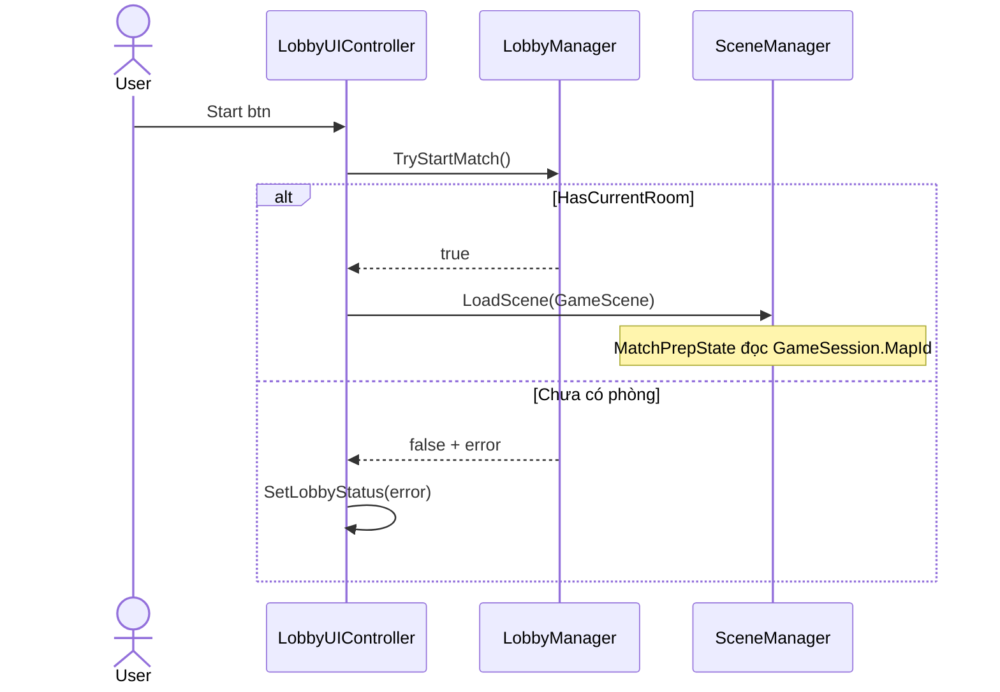
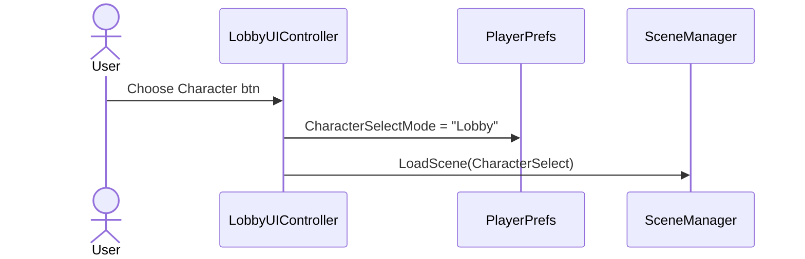

# UI Lobby

Giao diện scene **Lobby**: browse phòng, tạo/join, friends dialog, chọn nhân vật, start match.

UI chỉ nói chuyện với **`LobbyManager`** — không gọi API backend trực tiếp.

---

## Cấu trúc file

`LobbyUIController` là **partial class** chia theo feature:

| File | Nội dung |
|------|----------|
| `LobbyUIController.cs` | Scene nav, create room dialog, current room panel, map dropdown, `BindLobbyManagerEvents` |
| `LobbyUIController.RoomList.cs` | Room list scroll, refresh, join + room ID password dialog |
| `LobbyUIController.Friends.cs` | Nakama Friends / Requests tabs, lobby invite, join invited room |
| `LobbyRoomRowUI.cs` | Một dòng trong room list |
| `FriendRowUI.cs` | Một dòng friend |
| `FriendRequestRowUI.cs` | Accept / decline request |

---

## Scene hierarchy (gợi ý)

```txt
Canvas
├── HeaderPanel           roomIdInput, join, friends, back
├── RoomListPanel         scroll + refresh
├── CurrentRoomPanel      room info, create / choose char / start
├── CreateRoomDialogOverlay
├── PasswordDialog        (nhập room ID để join từ room list)
├── FriendsDialogOverlay
└── LobbyUIController     + LobbyManager (cùng GO)
```

---

## Inspector — wire bắt buộc

### LobbyUIController (main)

| Field | Ghi chú |
|-------|---------|
| Scene names | `MainMenu`, `CharacterSelect`, `GameScene` |
| `mapDropdown` | TMP_Dropdown; options build runtime từ `mapOptions` |
| `mapOptions` | List `LobbyMapOption` — **map id = index + 1** |
| Create room inputs | `roomNameInput`, `maxPlayersDropdown`, `passwordInput` hiển thị room ID |
| Current room labels | `currentRoomNamelbl`, `currentRoomIdlbl`, ... |

**Ví dụ `mapOptions`:**

| Index | displayName | mapId gửi lên API |
|-------|-------------|-------------------|
| 0 | Classic Garden | 1 |
| 1 | Desert Arena | 2 |
| 2 | Ice Cave | 3 |

Id phải khớp `MapLoader.MapEntry.mapId` trong GameScene.

### Room list (`LobbyUIController.RoomList`)

| Field | Ghi chú |
|-------|---------|
| `roomListContent` | Content của ScrollView |
| `roomRowTemplate` | Prefab có `LobbyRoomRowUI`, **tắt** mặc định |
| `refreshRoomListbtn` | Gọi `RequestRoomList` |
| `passwordDialog` | Bắt buộc cho join từ room list; người chơi nhập room ID |

### Friends (`LobbyUIController.Friends`)

| Field | Ghi chú |
|-------|---------|
| `friendsDialogOverlay` | Root dialog |
| `friendRowTemplate` / `requestRowTemplate` | Tắt mặc định, instantiate khi có data |

Context menu trên `LobbyRoomRowUI`: **Auto Bind From Children** — tự gán TMP/Button theo tên child.

---

## Khởi động (`Start`)

```txt
LobbyManager.EnsureExists()
BindLobbyManagerEvents()      ← subscribe tất cả events một lần
SetupLobbyButtons()
InitializeMapDropdown()       ← fill mapDropdown từ mapOptions
InitializeRoomListFeature()   ← RefreshRoomList()
InitializeFriendsFeature()
SetCurrentRoomEmpty()
```

---

## Sequence diagrams

### 1. Load lobby — room list



### 2. Tạo phòng



### 3. Join phòng (list / mã phòng)



### 4. Start game



### 5. Friends dialog

```mermaid
sequenceDiagram
    actor User
    participant UI as LobbyUIController
    participant LM as LobbyManager
    participant Row as FriendRowUI

    User->>UI: Friends btn
    UI->>LM: RequestFriendsList()
    UI->>LM: RequestFriendRequests()
    LM-->>UI: FriendsListed(friends)
    LM-->>UI: FriendRequestsListed(requests)
    UI->>Row: Spawn friend / request rows

    alt Invite friend (đang trong phòng)
        User->>Row: Invite
        UI->>LM: RequestInviteFriend(friendId, roomId)
    else Join friend's room
        User->>Row: Join
        UI->>LM: RequestJoinFriendRoom(friendId)
        LM-->>UI: CurrentRoomChanged (nếu thành công)
    end
```



### 6. Chọn nhân vật



---

## Luồng người chơi (tóm tắt)

```txt
Vào Lobby
  → Room list auto refresh
  → Create room HOẶC Join (list / mã / friend)
  → Current room panel cập nhật
  → Choose Character (optional)
  → Start → GameScene (cần đang trong phòng)
  → Back → ClearCurrentRoom + MainMenu
```

---

## Status & lỗi

- `SetLobbyStatus(message)` — ghi `lobbyStatuslbl` + `friendsStatuslbl`.
- `OnLobbyOperationFailed` — hiện lỗi chung; nếu password dialog đang mở thì ghi `passwordErrorText`.

---

## TODO / hạn chế hiện tại

- Friend list and friend requests use Nakama. Friend row `Join` only enables when friend metadata exposes `currentRoomId`; normal real-time joining is through lobby invite notifications.
- Steam status trong friends UI là placeholder.
- Password dialog dùng room ID làm password; header join tự gửi room ID làm password.

---

## Tài liệu liên quan

- Core layer: [`Assets/Scripts/Core/Lobby/README.md`](../../Core/Lobby/README.md)
- Contract chi tiết: `Documents/lobby (1).md`
- Wiki rút gọn: `Documents/wiki/Lobby.md`
